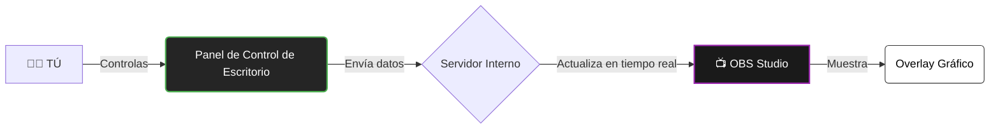
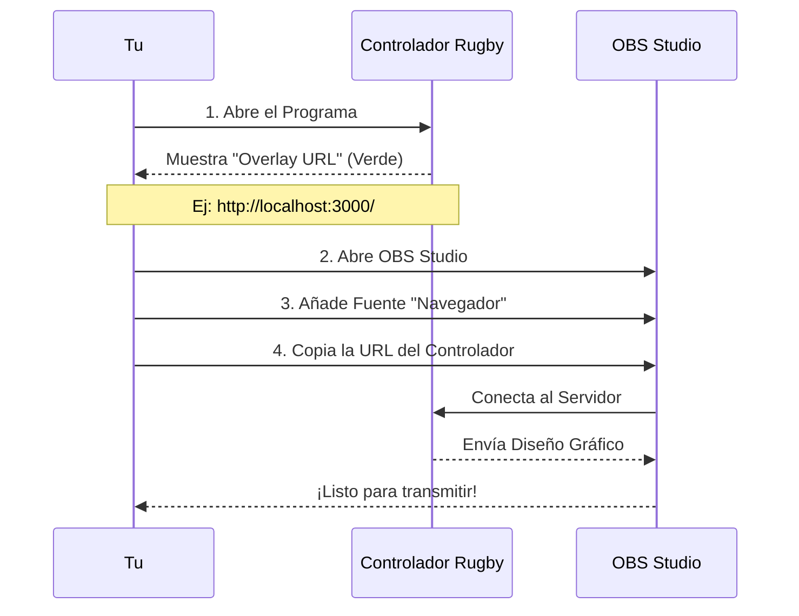
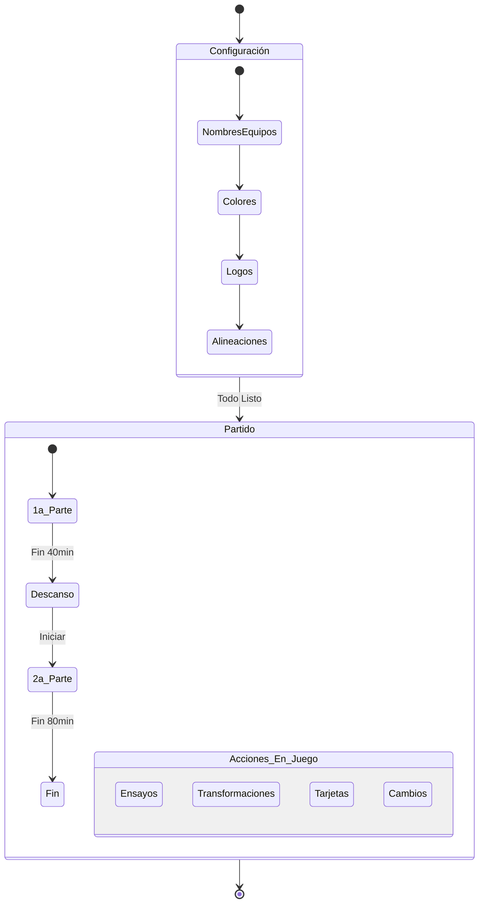
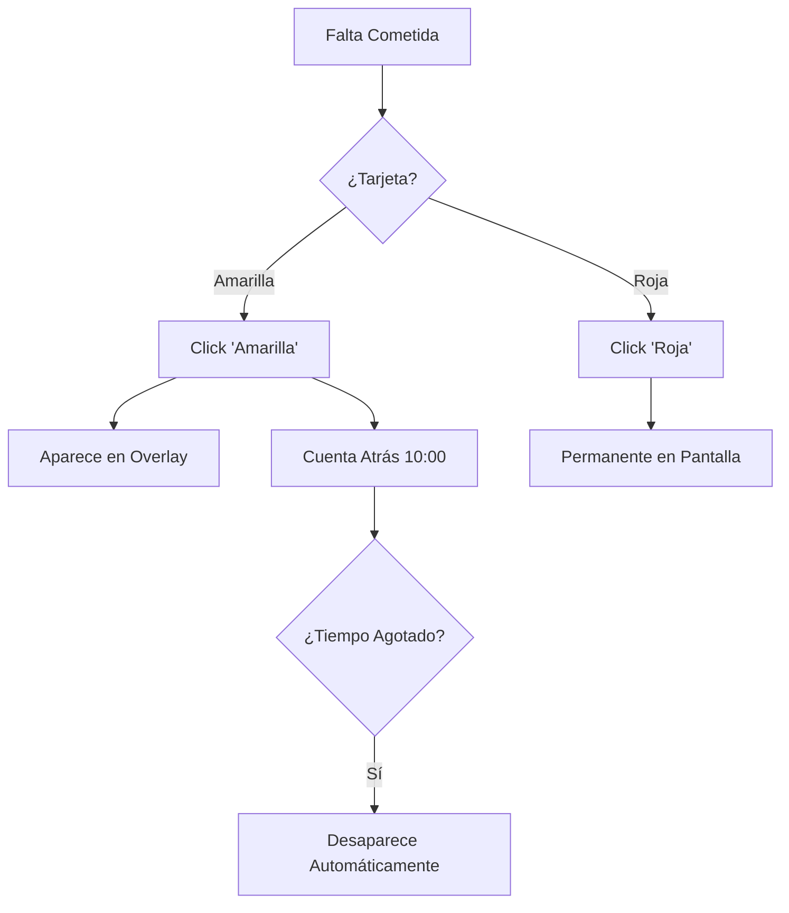

# 📘 Guía Visual de Uso - Rugby OBS Controller

Esta guía explica de forma visual cómo funciona el sistema y cómo operarlo durante un partido.

## 1. ¿Cómo funciona el sistema?

El sistema tiene dos partes que se comunican entre sí: el **Panel de Control** (lo que tú usas) y el **Overlay** (lo que ve la audiencia en OBS).

---

## 2. Conexión con OBS (Paso a Paso)

Sigue este diagrama para conectar tu controlador con OBS Studio antes del partido.

**📸 Captura de Ayuda:**
---

## 3. Flujo de Trabajo en un Partido

Así es como debes operar el sistema durante la retransmisión.

### 3.1 Gestión de Puntos
Usa los botones grandes de colores.
*   **Ensayo (Try)**: +5 Puntos.
*   **Conversión**: +2 Puntos.
*   **Golpe (Penalty)**: +3 Puntos.
*   **Drop**: +3 Puntos.
*   **Ensayo de Castigo**: +7 Puntos.

*(Al puntuar, el programa solicitará el autor/a para mostrar un rótulo automático en pantalla).*

### 3.2 Gestión de Tarjetas 🟨🟥
El sistema gestiona el tiempo de sanción automáticamente.

### 3.3 Gestión de Sustituciones 🔄
Realiza cambios en vivo de manera sencilla:
1. Selecciona el jugador/a titular que sale del campo.
2. Selecciona el jugador/a suplente que entra.
3. Pulsa el botón de cambio para confirmarlo y enviar automáticamente la animación al Overlay.

### 3.4 Pestañas de Resumen y Presentación 📊
Además de los controles principales, cuentas con pestañas dedicadas para enriquecer la retransmisión:
*   **Presentación:** Configura y muestra el cartel inicial con los detalles del partido, lugar, arbitraje y comentaristas.
*   **Resumen:** Visualiza un registro en tiempo real de todos los eventos del partido y proyecta estadísticas detalladas en pantalla.

---

## 4. Personalización Avanzada (Rótulos)

Puedes crear rótulos personalizados para mostrar información extra (ej. "Descanso", "Lesión", "Estadística").

1.  Ve a la pestaña **Rótulos**.
2.  Escribe Título y Subtítulo.
3.  Elige un color.
4.  Pulsa **MOSTRAR AHORA** para enviarlo al aire inmediatamente.
5.  O pulsa **GUARDAR** para tenerlo listo para después.

---

_Documento generado para Rugby OBS Controller v1.0.1_
